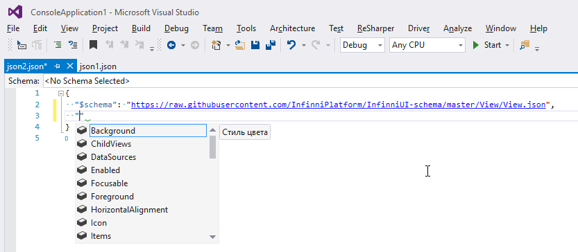
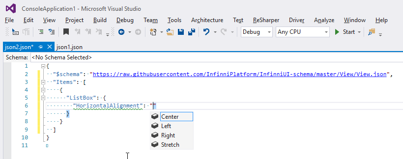

# InfinniUI-schema

InfinniUI-schema defines [JSON Schema](http://json-schema.org/) for views of [InfinniUI](https://github.com/InfinniPlatform/InfinniUI).

# Root Schema

```
https://raw.githubusercontent.com/InfinniPlatform/InfinniUI-schema/master/View/View.json
```

# Using Schema

Define `$schema` in your JSON:

```js
{
    "$schema": "https://raw.githubusercontent.com/InfinniPlatform/InfinniUI-schema/master/View/View.json",
    ...
}
```

# Autocomplete

Visual Studio supports autocomplete features.




